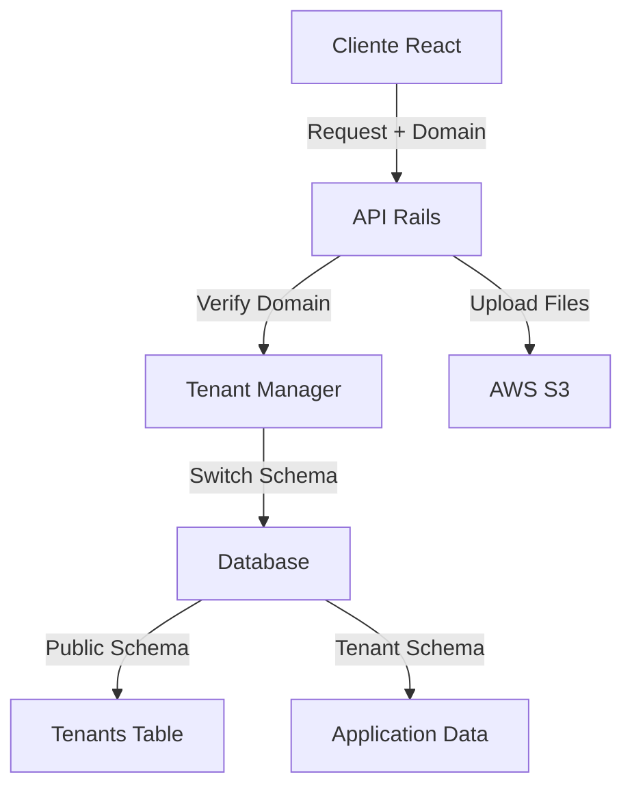

# Flujo de la Aplicación - Communities API

## Arquitectura General



## 1. Sistema Multi-tenant (Dominio)

### Gestión de Dominios
- Cada conjunto residencial es un tenant independiente
- Los tenants se almacenan en la tabla `tenants` del schema `public`
- Cada tenant tiene su propio schema en la base de datos

### Flujo de Cambio de Schema
1. Cliente envía request con el dominio
2. API verifica:
   - Existencia del dominio
   - Permisos de acceso
   - Estado del tenant
3. Usando la gema `apartment`:
   - Eleva los permisos
   - Cambia al schema correspondiente
   - Ejecuta la operación solicitada

## 2. Autenticación y Autorización

### Flujo de Acceso
1. **Registro de Usuario**
   ```mermaid
   sequenceDiagram
       Actor Usuario
       Usuario->>+API: Solicitud de registro
       API->>+DB: Validar datos
       DB->>-API: Confirmación
       API->>-Usuario: Respuesta de registro
   ```

2. **Inicio de Sesión**
   ```mermaid
   sequenceDiagram
       Actor Usuario
       Usuario->>+API: Credenciales
       API->>+DB: Validar usuario
       DB->>-API: Datos de usuario
       API->>-Usuario: Token JWT
   ```

3. **Recuperación de Contraseña**
   ```mermaid
   sequenceDiagram
       Actor Usuario
       Usuario->>+API: Solicitud recuperación
       API->>+Email: Envía instrucciones
       Email->>-Usuario: Link de recuperación
       Usuario->>+API: Nueva contraseña
       API->>-Usuario: Confirmación
   ```

## 3. Gestión de PQRs y Sugerencias

### Flujo de PQRs
1. **Creación**
   - Usuario crea petición/queja/reclamo
   - Se asigna categoría y prioridad
   - Se notifica a los administradores

2. **Seguimiento**
   - Usuarios pueden dar seguimiento
   - Administradores pueden responder
   - Sistema de notificaciones automáticas

### Flujo de Sugerencias
1. **Envío**
   - Usuario envía sugerencia
   - Se categoriza y almacena
   - Notificación a administradores

2. **Gestión**
   - Revisión por administradores
   - Respuesta y seguimiento
   - Actualización de estado

## 4. Gestión Empresarial y de Usuarios

### Administración de Empresas
- Creación y configuración de empresas
- Asignación de propiedades
- Gestión de información empresarial

### Gestión de Usuarios
- Sistema de roles y permisos
- Asignación de usuarios a empresas
- Gestión de accesos y privilegios

## 5. Almacenamiento de Archivos

### Integración con AWS
- Los archivos se almacenan en AWS S3
- Gestión segura de uploads
- Control de acceso a archivos

## 6. Integración Frontend-Backend

### Arquitectura de Comunicación
- Frontend: React ([communities-app](https://github.com/remolacho/communities-app))
- Backend: Ruby on Rails API
- Comunicación vía REST API
- Autenticación mediante JWT

## 7. Seguridad

### Medidas Implementadas
- Autenticación JWT
- Segregación por tenant
- Control de acceso basado en roles
- Encriptación de datos sensibles
- Logs de auditoría

## Notas de Implementación

### Consideraciones Técnicas
1. **Base de Datos**
   - PostgreSQL con schemas independientes
   - Gema apartment para gestión multi-tenant
   - Migraciones automáticas por tenant

2. **API**
   - RESTful endpoints
   - Versionado de API
   - Rate limiting
   - Documentación Swagger

3. **Frontend**
   - React con CoreUI
   - Estado global con Redux
   - Rutas protegidas
   - Componentes reutilizables

### Mejores Prácticas
- Clean Architecture
- DRY (Don't Repeat Yourself)
- SOLID Principles
- Test Driven Development

## Actualizaciones del Flujo
Este documento debe actualizarse cuando:
1. Se agreguen nuevos módulos
2. Se modifiquen flujos existentes
3. Se implementen nuevas integraciones
4. Se actualicen políticas de seguridad

### Historial de Actualizaciones
| Fecha | Versión | Descripción |
|-------|---------|-------------|
| 2024-03-19 | 1.0 | Versión inicial - Documentación de flujos base |
