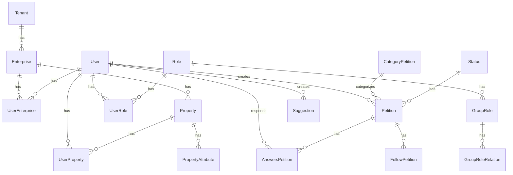

# Modelos de Base de Datos - Communities API

## Diagrama de Relaciones

## Modelos Principales

### Sistema Multi-tenant
#### `Tenant`
- Representa una instancia única de comunidad/conjunto residencial
- Atributos principales:
  - name: string
  - status: enum
- Relaciones:
  - has_many :enterprises

### Gestión de Empresas y Usuarios
#### `Enterprise`
- Representa una empresa o entidad administrativa
- Atributos principales:
  - name: string
  - address: string
  - phone: string
  - email: string
  - status: enum
- Relaciones:
  - belongs_to :tenant
  - has_many :user_enterprises
  - has_many :users, through: :user_enterprises
  - has_many :properties

#### `User`
- Representa un usuario del sistema
- Atributos principales:
  - email: string
  - first_name: string
  - last_name: string
  - phone: string
  - status: enum
- Relaciones:
  - has_many :user_enterprises
  - has_many :enterprises, through: :user_enterprises
  - has_many :user_roles
  - has_many :roles, through: :user_roles
  - has_many :petitions
  - has_many :suggestions

### Sistema de Roles y Permisos
#### `Role`
- Define roles de usuario en el sistema
- Atributos principales:
  - name: string
  - key: string
  - status: enum
- Relaciones:
  - has_many :user_roles
  - has_many :users, through: :user_roles
  - has_many :group_roles
- Propósito:
  - Gestión de permisos generales del sistema
  - Control de acceso a funcionalidades
  - Definición de capacidades de usuario

#### `GroupRole`
- Gestiona la privacidad y visibilidad de registros entre grupos
- Propósito principal:
  - Control de acceso a nivel de grupo para peticiones y registros
  - Permite a usuarios definir qué grupos pueden ver sus registros
  - Facilita la privacidad y compartición selectiva de información
- Relaciones:
  - belongs_to :role
  - has_many :group_role_relations
- Casos de uso:
  - Definir visibilidad de peticiones entre diferentes grupos
  - Controlar acceso a registros específicos
  - Gestionar privacidad de contenido

#### `GroupRoleRelation`
- Implementa las relaciones de visibilidad entre grupos y registros
- Propósito:
  - Establece conexiones entre grupos y registros específicos
  - Define permisos de visibilidad granulares
  - Permite control de acceso flexible a nivel de registro
- Relaciones:
  - belongs_to :group_role
  - belongs_to :role
- Funcionalidad:
  - Permite a usuarios especificar qué grupos pueden ver sus registros
  - Facilita la compartición selectiva de información
  - Mantiene la privacidad de registros entre diferentes grupos

### `UserRole`
- Une usuarios con roles del sistema
- Relaciones:
  - belongs_to :user
  - belongs_to :role
- Propósito:
  - Asignar roles generales del sistema a usuarios
  - Definir permisos base de usuario
  - Controlar acceso a funcionalidades del sistema

## Notas sobre el Sistema de Roles

### Separación de Responsabilidades
1. **Roles Generales del Sistema**
   - Gestionados por `Role` y `UserRole`
   - Controlan acceso a funcionalidades del sistema
   - Definen permisos generales de usuario

2. **Control de Visibilidad por Grupos**
   - Manejado por `GroupRole` y `GroupRoleRelation`
   - Enfocado en privacidad y visibilidad de registros
   - Permite control granular de acceso a nivel de registro

### Casos de Uso Típicos
1. **Creación de Peticiones**
   - Usuario crea una petición
   - Selecciona grupos que pueden verla mediante GroupRole
   - Sistema establece relaciones de visibilidad con GroupRoleRelation

2. **Control de Acceso**
   - Roles generales controlan qué pueden hacer los usuarios
   - GroupRoles controlan qué pueden ver los usuarios

### Consideraciones de Seguridad
- Validación de permisos a nivel de sistema y grupo
- Segregación clara entre permisos de acción y visibilidad
- Control granular de acceso a registros

### Gestión de Propiedades
#### `Property`
- Representa una propiedad dentro de una comunidad
- Atributos principales:
  - name: string
  - address: string
  - status: enum
- Relaciones:
  - belongs_to :enterprise
  - has_many :property_attributes
  - has_many :user_properties
  - has_many :users, through: :user_properties

#### `PropertyAttribute`
- Atributos específicos de una propiedad
- Atributos principales:
  - key: string
  - value: string
- Relaciones:
  - belongs_to :property

### Sistema de PQRs
#### `Petition`
- Representa una petición, queja o reclamo
- Atributos principales:
  - title: string
  - description: text
  - priority: enum
- Relaciones:
  - belongs_to :user
  - belongs_to :category_petition
  - belongs_to :status
  - has_many :answers_petitions
  - has_many :follow_petitions

#### `CategoryPetition`
- Categoriza los tipos de peticiones
- Atributos principales:
  - name: string
  - description: text
- Relaciones:
  - has_many :petitions

#### `Status`
- Estado de las peticiones
- Atributos principales:
  - name: string
  - key: string
- Relaciones:
  - has_many :petitions

### Sistema de Sugerencias
#### `Suggestion`
- Representa sugerencias de la comunidad
- Atributos principales:
  - title: string
  - description: text
  - status: enum
- Relaciones:
  - belongs_to :user

## Tablas de Unión

### `UserEnterprise`
- Une usuarios con empresas
- Relaciones:
  - belongs_to :user
  - belongs_to :enterprise

### `UserProperty`
- Une usuarios con propiedades
- Relaciones:
  - belongs_to :user
  - belongs_to :property

### `UserRole`
- Une usuarios con roles
- Relaciones:
  - belongs_to :user
  - belongs_to :role

### `GroupRoleRelation`
- Gestiona relaciones entre grupos de roles
- Relaciones:
  - belongs_to :group_role

## Notas Técnicas
1. **Soft Delete**: La mayoría de los modelos implementan soft delete para mantener históricos
2. **Timestamps**: Todos los modelos incluyen created_at y updated_at
3. **Validaciones**: Cada modelo incluye validaciones específicas de negocio
4. **Scopes**: Se utilizan scopes para consultas comunes
5. **Enums**: Se utilizan enums para estados y tipos predefinidos

## Consideraciones de Seguridad
- Implementación de políticas de acceso por rol
- Segregación de datos por tenant
- Encriptación de datos sensibles
- Trazabilidad de cambios en registros críticos
