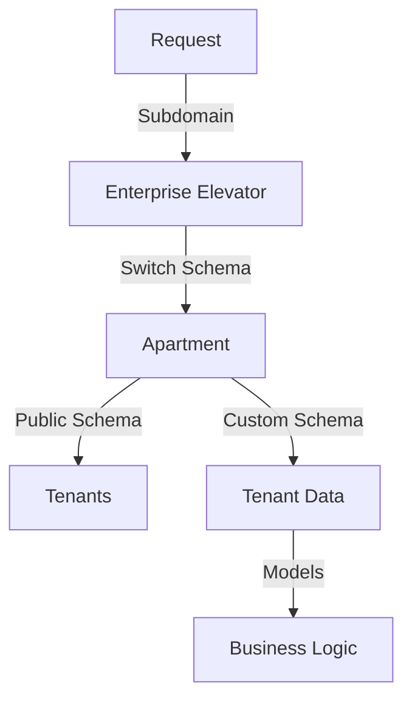
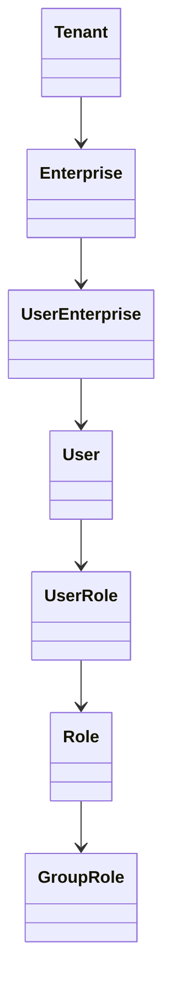
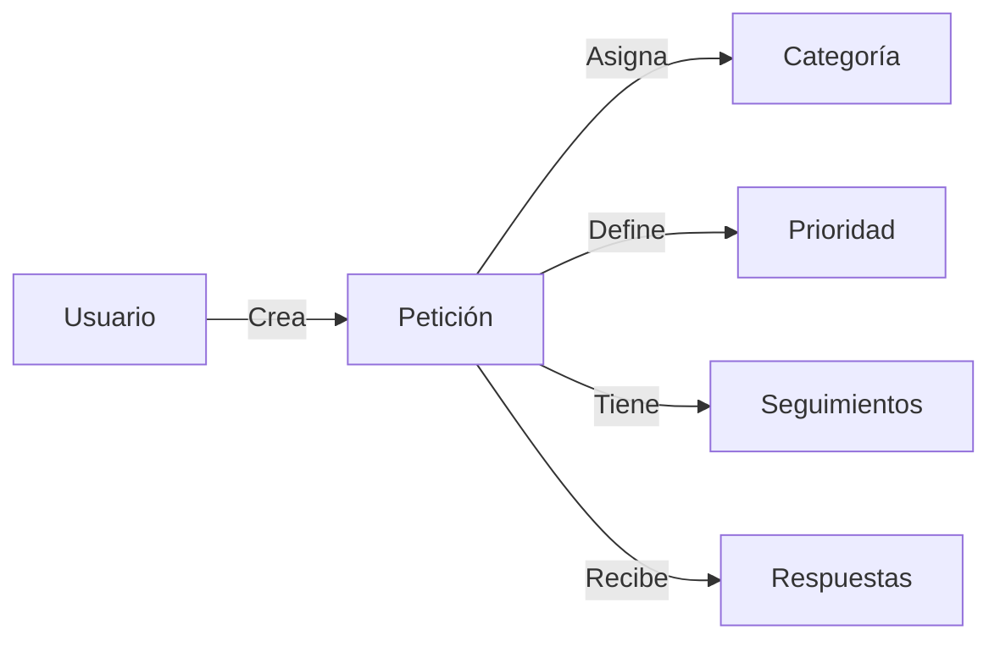

# Análisis Técnico - Communities API

## Resumen Ejecutivo
Communities API es una aplicación Ruby on Rails que implementa una arquitectura multi-tenant para la gestión de comunidades residenciales. La aplicación está diseñada siguiendo principios de Clean Architecture y utiliza patrones de diseño modernos para garantizar mantenibilidad y escalabilidad.

## Arquitectura

### 1. Sistema Multi-tenant

#### Implementación
- Utiliza la gema `apartment` para manejo de schemas
- Schema público para gestión de tenants
- Schemas independientes por comunidad
- Elevator personalizado para ruteo por subdominios
- Migración automática de schemas

### 2. Estructura de Código

#### Modelos Core

#### Patrones Implementados
1. **Service Objects**
   - Encapsulación de lógica de negocio
   - Manejo de transacciones
   - Validaciones complejas

2. **Concerns**
   - Modularización de funcionalidad común
   - Reutilización de código
   - Separación de responsabilidades

3. **Policies**
   - Control de acceso granular
   - Autorización basada en roles
   - Segregación de permisos

### 3. Seguridad

#### Autenticación
- JWT para tokens de acceso
- Manejo seguro de contraseñas con `has_secure_password`
- Tokens de activación y recuperación
- Expiración de tokens configurable

#### Autorización
- Sistema de roles jerárquico
- Políticas por recurso
- Validación de subdominios
- Segregación de datos por tenant

### 4. Gestión de Datos

#### Base de Datos
- PostgreSQL con schemas dinámicos
- Soft deletes implementados
- Índices optimizados
- Relaciones bien definidas

#### Storage
- Active Storage para archivos
- Integración con AWS S3
- Manejo de avatares y logos
- Control de acceso a archivos

### 5. Módulos Principales

#### Sistema de PQRs

#### Gestión Empresarial
- Manejo de múltiples empresas
- Asignación de usuarios
- Control de propiedades
- Gestión de roles

### 6. Integraciones

#### Frontend
- Aplicación React separada
- CoreUI como framework UI
- Comunicación vía API REST
- Gestión de estado con Redux

#### Servicios Externos
- AWS S3 para almacenamiento
- SMTP para correos
- Swagger para documentación
- Excel para importaciones

### 7. Herramientas de Desarrollo

#### Testing
- RSpec para pruebas
- Swagger para documentación de API
- Factories para datos de prueba
- Coverage tracking

#### Calidad de Código
- Rubocop para linting
- Anotaciones automáticas
- Documentación inline
- Convenciones Rails

## Consideraciones Técnicas

### Escalabilidad
1. **Horizontal**
   - Schemas independientes por tenant
   - Servicios stateless
   - Caching configurable

2. **Vertical**
   - Queries optimizadas
   - Índices estratégicos
   - Batch processing

### Mantenibilidad
1. **Código**
   - Modularización clara
   - Patrones consistentes
   - Documentación exhaustiva

2. **Operaciones**
   - Logs estructurados
   - Monitoreo integrado
   - Gestión de errores

## Recomendaciones Futuras

### Mejoras Potenciales
1. **Técnicas**
   - Implementar caching
   - Añadir background jobs
   - Mejorar monitoring

2. **Funcionales**
   - Sistema de notificaciones
   - Reportes avanzados
   - Integración con servicios adicionales

### Escalamiento
1. **Infraestructura**
   - Configurar load balancing
   - Implementar CDN
   - Optimizar bases de datos

2. **Aplicación**
   - Microservicios específicos
   - API versioning
   - Cache distribuido

## Historial de Actualizaciones
| Fecha | Versión | Descripción |
|-------|---------|-------------|
| 2024-03-19 | 1.0 | Análisis técnico inicial |
